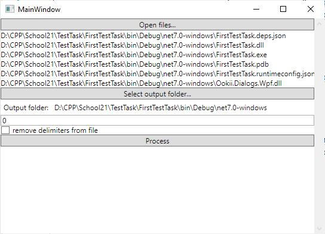

# Обработка файлов

## Обзор

Данное приложение представляет собой программный инструмент, разработанный для обработки текстовых файлов с целью
оптимизации их содержимого. В его основе лежит специальный алгоритм, который обеспечивает эффективную обработку данных с
учетом заданных параметров

## Основные функциональные возможности

Программа принимает на вход пути до файлов, выходную директорию, максимальную длину слов (N) и флаг удаления
разделителей. Это позволяет настроить обработку файлов в соответствии с конкретными требованиями пользователя.

Результат работы программы представляет собой преобразованные файлы в формате `<path>.processed.<ext>`. Каждое слово,
длина которого превышает заданное значение N, подвергается удалению. При
наличии соответствующего флага, разделители между словами могут быть удалены.

Так же программа спокойно справляется с файлами размером в 10 ГБ.

## Неочевидный момент

Если на входе будет `Word1!Word2` с флагом удаления раздетилетей и N = 5, на выходе получится пустой файл т.к снача
произойдёт удаление разделителей, а именно удалится символ `!`, произойдёт конкатенация слов и последующее удаление
слова из выходного словаря.